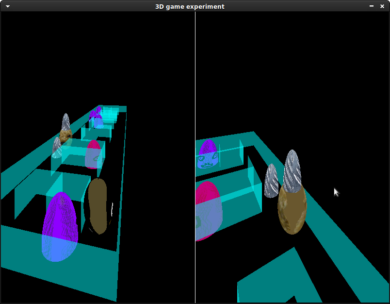

# 3D game experiment

This is a dual-player 3D game with no libraries used for drawing the 3D stuff.




## Setup

Commands to compile and run:

```
$ git submodule init
$ git submodule update
$ sudo apt install gcc make libsdl2-dev libsdl2-mixer-dev libsdl2-ttf-dev
$ make -j2
$ ./game
```

## Key Bindings

In the game:
- Moving around and flattening: right player uses arrow keys, left player uses W, A, S and D imagining that they are arrow keys.
- Leaving guards behind: left player uses F, right player uses zero.
  If the zero key isn't next to the arrow keys on your keyboard, then
  please [let me know](https://github.com/Akuli/3d-game-experiment/issues/new)
  which key would be more convenient for you.

In the player and place choosing screen, you can click the buttons or press these keys:
- Player chooser: right player uses left and right arrow keys, left player users A and D.
- Place chooser: up and down arrow keys, or W and S. The purpose is that both players can use the place chooser.
- Play button: enter or space.

In the game over screen, you can again click buttons or press these keys:
- Play again button: F5. This is for compatibility with games where you can play again by refreshing the browser window.
- Player and place chooser button: enter or space.


## Broken Things

- With low enough fps and high enough player speed, it's possible to run
  through a wall. This happens when the player can get to the other side
  of the wall before the each-frame-running collision check. Current
  workaround is to not make the players go so fast that this would
  happen at 30fps. (Yes, I know that 30fps is really slow for any gamer)


## Feature Ideas

- stereo sound: if left player jumps then jump sound (mostly?) to left speaker
- network multiplayer lol?


## Conventions in this project

- To avoid a global variable, it's fine to do this...

    ```c
    struct Foo *get_foos()
    {
        static struct Foo res[N_FOOS];
        static bool ready = false;
        if (ready)
            return res;

        for (int i = 0; i < N_FOOS; i++)
            res[i] = create_foo();
        ready = true;
        return res;
    }
    ```

    ...except when that takes a long time on startup. In that case, I use a
    global variable instead. This isn't as bad as you might think because:
    - As opposed to lazy-loading everything, I can display meaningful
      "Loading bla..." texts while the game starts.
    - I don't need to pass around a lot of variables everywhere.
    - All global variables are intended to be immutable, and there should be no
      mutable global state to cause problems.

- My coding style is linux-kernel-ish, but I'm not at all nit-picky about it.
  Contributions are welcome, although I usually don't get many, especially in
  projects written in C.


## Windows Build

You can build a Windows `.exe` file of this game on Linux.

Start by downloading the Windows "Development Libraries" of SDL2, SDL_mixer and SDL_ttf.
Choose MinGW when you need to choose between MinGW and Visual C++.

https://www.libsdl.org/download-2.0.php

https://www.libsdl.org/projects/SDL_mixer/

https://www.libsdl.org/projects/SDL_ttf/

Copy them to a directory named `libs` and extract:

```
$ cd path-to-directory-containing-this-README-file
$ mkdir libs
$ cp ~/Downloads/{SDL2,SDL2_mixer,SDL2_ttf}-devel-*-mingw.tar.gz libs
$ cd libs
$ tar xf SDL2-*
$ tar xf SDL2_mixer-*
$ tar xf SDL2_ttf-*
$ cd ..
```

You may need to replace `~/Downloads/...` with something else if your system isn't
in English. For example, I need `~/Lataukset/...` on my Finnish system.

Do this if you want to use wine for running tests and the produced executable:

```
$ sudo apt install mingw-w64 winehq-stable
$ source winbuildenv
$ make clean
$ make -j2
$ wine build/game.exe
```

Do this if you don't want to use wine:

```
$ sudo apt install mingw-w64
$ source winbuildenv
$ make clean
$ make -j2 build/game.exe
```
